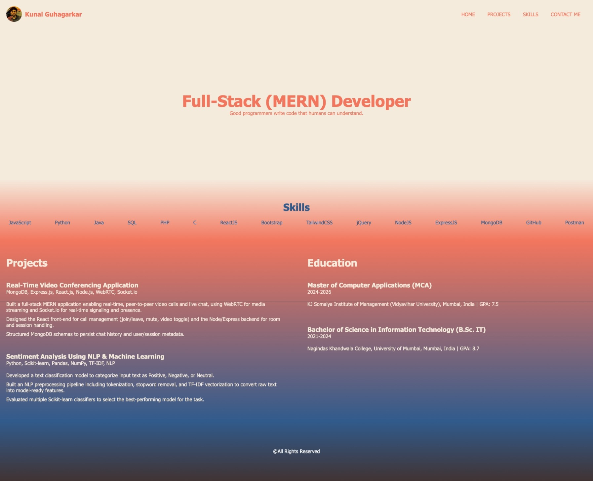
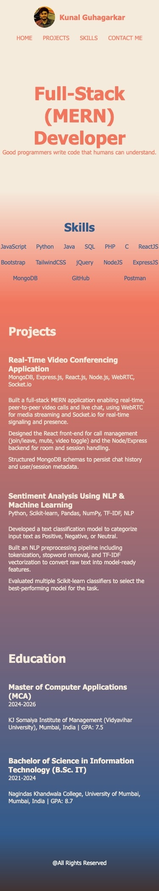

# Personal Portfolio

A responsive personal portfolio website built with plain **HTML** and **CSS**. It showcases my skills, projects, and education in a clean, colourful layout that adapts to both desktop and mobile screens.

This project is my solution to the [Personal Portfolio](https://roadmap.sh/projects/portfolio-website) frontend project on roadmap.sh.

## Screenshots

_Add desktop and mobile screenshots here_

| Desktop | Mobile |
| ------- | ------ |
|  |  |

## Features

- Header with a circular profile image, name, and navigation links
- Hero section with title and tagline
- Skills section listing languages, frameworks, and tools
- Projects section with tech stack and key highlights for each project
- Education section with degrees, years, institutions, and GPA
- Smooth colour gradients flowing from section to section
- Fully responsive layout using Flexbox and a media query

## Built With

- **HTML5**: semantic structure (`header`, `nav`, `main`, `section`, `footer`)
- **CSS3**:
  - Flexbox for layouts (navbar, skills, projects and education columns)
  - Media queries for responsiveness
  - `rem` units for scalable typography
  - Linear gradients for section backgrounds
  - Box model (`box-sizing: border-box`, margins, padding)

## Project Structure

```
.
├── index.html
├── style.css
└── images/
    └── images.jpeg
```

> Adjust this to match your actual folders. Your HTML currently references the image as `../images/images.jpeg`, so keep the paths consistent.

## Getting Started

1. Clone the repository:

   ```bash
   git clone https://github.com/<your-username>/<your-repo-name>.git
   ```

2. Open the project folder:

   ```bash
   cd <your-repo-name>
   ```

3. Open `index.html` in your browser (or use the VS Code **Live Server** extension).

No build tools or dependencies are needed.

## Responsive Design

The layout adapts at a breakpoint of **768px**:

| Screen | Behaviour |
| ------ | --------- |
| Desktop (> 768px) | Header items sit side by side; Projects and Education appear in two columns |
| Mobile (≤ 768px) | Base font size drops to 85%; header stacks vertically with centred nav; Projects and Education stack in a single column |

## Colour Palette

| Colour | Hex |
| ------ | --- |
| Cream (background) | `#f5ebdd` |
| Coral (accent) | `#f2765e` |
| Blue (text/accent) | `#315b8c` |
| Dark brown (footer) | `#413333` |

## Future Improvements

- Working navigation links that scroll to each section
- Contact form
- Dark mode using CSS variables
- Google Fonts for custom typography
- Links to project repositories and live demos
- Hover effects and CSS transitions

## Author

**Kunal Guhagarkar**
Full-Stack (MERN) Developer

- GitHub: [https://github.com/KunalGuhagarkar](https://github.com/KunalGuhagarkar)
- LinkedIn: [www.linkedin.com/in/kunalguhagarkar](https://www.linkedin.com/in/kunalguhagarkar/)

## Acknowledgements

- [roadmap.sh](https://roadmap.sh/) for the project idea and requirements